# AEDS: Sugestões de Palavras

A pedido do professor de Algoritmos e Estruturas de Dados do CEFET - Divinópolis, foi desenvolvido um algoritmo em C++, que executa X arquivos do tipo .txt e monta 3 arvores (Binaria, AVL, Huffman) com as K palavras mais frequentes em cada arquivo.

# Sumário

- [Objetivo](#objetivo)
- [Especificações Gerais](#especificações-gerais)
- [Arquivos](#pastas-e-arquivos)
- [Lógica](#lógica)
- [Árvores](#árvores)
- [Ferramentas](#ferramentas)
- [Output](#output)
- [Conclusão](#conclusão)
- [Referências](#referências)

# Objetivo

Esse algoritmo tem como objetivo percorrer vários arquivos .txt, ler cada linha e contabilizar a frequência de cada palavra em cada arquivo, analisando se elas são diferentes de Stop Words, caso forem não farão parte do cálculo de ocorrência, em seguida vai ser criado um heapify com as K palavras mais frequente em cada arquivo. O código também vai ler um arquivo input.data com as palavras que serão pesquisadas comparando-as ao heapify, para montar 3 tipos de árvores (Binária, AVL e Huffman). Ademais, como resultado um output com todas essas informações obtidas.

# Especificações Gerais

<ul  align="justify">
<li>(1): Ler diferentes arquivos do tipo .txt criando uma tabela de dispersão (hash) para contabilizar a ocorrência de cada palavra diferente de stop word.</li>
<li>(2): Criar um heap e colocar os K primeiro elementos da hash nela.</li>
<li>(3): Para todos elementos da hash restante comparar com a palavra de menor ocorrência do heap, caso o elemento do heap for maior é necessário remover do heap a de menor valor e adicionar a atual que está sendo comparada. Caso contrário apenas continuar a leitura da hash. </li>
<li>(4): Ler um arquivo input.data que contém as palavras que serão pesquisadas em todos os arquivos. </li>
<li>(5): Montar 3 tipos de arvore, uma binária, outra AVL e uma de Huffman, apenas se a palavra pesquisada estiver naquele texto.</li>
<li>(6): Apresentar um arquivo de saída com todas as informações obtidas, exceto a hash e o heapify.</li>
</ul>

- TEM QUE DEFINIR OS VALORES K (quantos elementos para o rank) E ALL (quantos arquivos serão lidos) DENTRO DO functions.cpp, e adicionar o nome dos arquivos dentro do arquivo functions.cpp dentro da função returnHash(), no vector textos;

## Arquivo de Entrada

 <ul>
    <li>1 - Todos os arquivos devem ter o mesmo formato (.txt);</li>
    <li>2 - O arquivo de stop word deve ser único, e nomeado como o exemplo: stopWord.txt;</li>
    <li>3 - O arquivo de stop word deve ter a seguinte formatação: uma palavra por linha e não pode conter expressões;</li>
    <li>4 - O arquivo das palavras que devem ser pesquisadas deve ser único, e nomeado como o exemplo: input.data;</li>
    <li>5 - O arquivo deve ter a seguinte formatação: a palavra por linha e não pode conter expressões;</li>
 </ul>

# Pastas e Arquivos

### Pasta input

Nessa pasta deve ser colocado o arquivo input.data, o stopWords.txt e dentro da pasta texts todos os arquivos que serão utilizado como texto para criação das hash.

### Pasta src

* `main.cpp`: O arquivo é responsável por inicializar todo o processo;
* `functions.cpp`: arquivo que se encontram as todas as funções do algortimo;
* `library.hpp`: arquivo que contém os cabeçalhos das bibliotecas que serão usadas em todo o algoritmo;
* `structs.hpp`: arquivo que contém as estrutas que serão usadas em todo o algoritmo;
* `Makefile`: arquivo de execução do algoritmo

### Pasta output

Essa pasta sera o destino do arquivo gerado pelo algoritmo: o output.data;

# Lógica 

O algoritmo começa criando uma Hash do tipo [map](#map) que vai conter todas as palavras de cada arquivo, também é retornado uma outra Hash do tipo [unordered_map](#unordered_map) que contém todas as stop words lidas do arquivo da pasta input através da função `returnAllStopWord();`. O tipo map foi escolhido por ser mais eficiente quando se trata de grandes quantidades de dados e quando é necessário acessar as palavras em sequência apresenta melhor utilidade. Já o unordered_map, por apresentar mais praticidade em encontrar valores de forma não sequencial (aleatório) que é o caso de quando precisar verificar uma stop word. Ao final do loop de leitura do arquvio é chamada uma função nomeada `toCreteTree(...);` que vai ser a responsável por criar as 3 árvores. Dentro dessa função é chamada 2 vezes a função `returnHeap(...)` uma que vai retornar o heapify das K palavras mais frenquentes e outra que vai retornar o heapify das K+1 palavras mais frenquentes naquela hash daquele arquivo. A função `returnQueue(...)` também é chamada para criar uma fila de prioridade com a heapify daquele arquivo. Através da função `returnResearchWords();` será obtido um vetor com todas as palavras que serão pesquisadas. Dentro de um loop será executado as funções retornaveis (`binaryTree(...)`, `AVL_Tree(...)` e `HuffmanTree`) de acordo com as palavras a serem pesquisadas. Caso a palavra esteja no texto será feito as árvores, caso não esteja não sera feito nada. Caso a palavra pesquisada esteja no heapify será utilizado a heap com k+1 palavras tirando a palavra equivalente a pesquisada (que repete). Todas essas funções retornam as árvores que são salvas em uma struct denominada `ResultWordResearch`. Ao fim se chama a função `saveOutput(...);` que pega todas as informações da struct ResultWordResearch e salva no arquivo output.data.

### Especificando a lógica

* ` returnAllStopWord();` : essa função abre o arquivo em modo de leitura, cria uma hash temporariamente, e vai salvando todas as stopwords presente no arquivo (stopWord.txt) ao final retorna essa hash.
*  `returnHash();` : essa função vai percorrer todos os arquivos por linha, em cada linha é chamada a função `cleanline(string line);` que remove todos caracteres desnecessários (,;.!?.\|(){}[]) através da função [erase](#erase) da biblioteca string, depois é feito uma tokenização através do [istringstream](#istringstream) e dentro de um loop chama a função `void updateWord(word,wordHash,allStopWords);` onde word é o token, no final retorna uma hash com as palavras presente naquele arquivo sem as stopWords. Após o loop, será chamada a função `void toCreateTree(wordHash,textos[i],output);` e ao final da sua execução apagar a hash criada.
* `void updateWord(word,wordHash,allStopWords);` :  essa função pega a palavra que foi passada como parâmetro e passa ela toda para minúsculo através da função `void toLowercase(string word)`, logo em seguida ele procura se essa palavra é uma stopword, caso sim dá um return, caso contrário ela procura a palavra na hash para checar se ela já foi adicionada e aumentar a ocorrência ou apenas adicionar sua primeira aparição.
* `toLowercase(string word);` :  faz uso da função [transform](#transform) da biblioteca algorithm para transformar a palavra em minúscula e, em seguida, retorna a palavra já tratada.
* `toCreateTree(wordHash,textos[i],output);` essa função chama 2 vezes a função `returnHeap(wordHash);` para retornar 2 heapify, um com K palavras e outra com K+1. Em seguida se chama a `returnQueue(heapWord)` que monta uma fila de prioridade com as palvras do heapify, também é chamada a função `returnResearchWords();` que coloca em um vetor todas as palavras que estão no arquivo de palavras a serem pesquisadas. Dentro de um loop verifica se a palavra está no arquivo, caso sim continua a execução, caso não, passa para a próxima palavra. Se a palavra pesquisa estiver na heapify será utilizado o heap que tem K+1, para criar as árvores. Atendido todos esses critérios é executado as funções (`binaryTree(...)`, `AVL_Tree(...)` e `HuffmanTree`) que retorna as árvores que são salvas em uma sruct auxiliar. Logo, é chamada a função `saveOutput(output,vetor);` que salva toda a struct num arquivo output.data;
* `returnHeap(wordHash,0) & returnHeap(wordHash,1);` : dentro de um for que percorrer toda a hash de palavras, essa função pega os primeiros K+i elementos da hash e faz um heapify após pegar todos eles através da função `void makeHeap(heapWord)`, onde heapWord é um vector do tipo pair do tipo string e int. Quando passar dos K +i elementos será executado a função `void lookInTheHeap(auxHeapWord,heapWord);` todas vez que ler uma nova palavra da hash.
* `makeHeap(heapWord)` : essa função apenas aplica o conceito de [heapify](#heapify) deixando sempre na primeira posição a palavra de menor ocorrência.
* `void lookInTheHeap(auxHeapWord,heapWord);` : apenas faz a verificação se a palavra atual da hash é maior que a primeira posição do heap, caso sim faz a substituição e chama a função makeheap.
* `returnQueue(heapWord)`: retorna uma fila de prioridade do tipo  das palavras do heapify de acordo com suas ocorrências através de um loop que percorre todo vetor.
* `returnResearchWords();`: le todo o arquivo input.data e salva as palavras em um vetor e retorna ele.
* `binaryTree(...)`, `AVL_Tree(...)` e `HuffmanTree(...)`: apenas cria as árvores de cada tipo de acordo com suas especificações (acesse nesse Readme as informações de cada árvore, [Binária](#binária), [AVL](#avl) e [Huffman](#huffman)).
* `void saveOutput(output,vetor)`: através de um loop ele pega todas as informações salvas no bloco vetor, utilizando a função especifica para cada árvore, sendo elas (`saveWidthHuffman(...)`,`saveWidthBinary(...)` e `saveWidthAVL(...)`), sendo tudo colocado em print de Largura.

# Árvores

### Binária

Uma árvore binária é uma estrutura de dados que armazena dados em forma de árvore. Cada nó de uma árvore binária tem no máximo dois filhos, chamados de filho esquerdo e filho direito. Onde tem o conceito de filho menor que o nó para esquerda e o filho maior que o nó para direita. Assim os valores menores sempre estarão à esquerda, e os maiores à direita.

 

Na função responsável por criar essa árvore ela percorre todo o vetor adicionando cada palavra de acordo com sua ocorrência. Vale ressaltar que é uma função recursiva.
É aconselhado usar a árvore de pesquisa (Binária) quando se deseja ter um acesso direto e sequencial eficiente, facilidade de inserção e retirada de registros, boa taxa de utilização de memória e utilizar memória primária e secundária. Vale ressaltar que a implementação foi disponibilizada pelo professor, a qual foi sujeitas às mudanças para o C++.

- Custo computacional de pesquisa na árvore binária é O(1) no melhor caso, O(n) no pior caso e O(logn) no caso médio.

### AVL

Já a árvore AVL tem a mesma lógica de filhos menores a esquerda e filhos maiores a direita, mas como a Binária pode ter sub-árvores muito grande de um lado do que de outro fazendo ela perder seu custo de de caso médio de logn, a AVL faz uso das rotações para balancear os nós. Para fazer esse balanceamento cada nó até a raiz recebe um valor que avalia cada sub-árvore. A sub-árvore que tiver uma altura igual ou maior a 2 ela sofre rotação.
  
Explicando o código, dentro da função `AVL_Tree(...)` o dado a ser gravado é passado para um auxiliar denominado record, de acordo com a palavra pesquisada está ou não na heapify, chama-se a função `insertTree_AVL(...)` para adicionar o elemento na árvore. Dentro dessa função olha se o ponteiro atual aponta para nulo, caso sim o novo elemento é inserido ali, caso não verifique se o valor da ocorrência é maior ou menor para onde o ponteiro está apontando. Caso menor, chama a função novamente passando a sub-árvore esquerda, depois confere se a inserção causou desbalanço na árvore. Em caso da soma ser igual a 2 vai verificar o tipo de balanceamento que vai ser necessário, caso o valor inserido for menor/igual ao filho da esquerda sub-árvore atual, será feito uma rotação simples à direita através da função `spinSimple_Right(...)`, caso não faz-se uma rotação dupla à direita com a função `spinDouble_Right(...)`. ao final de toda função se passa o cálculo de nível daquela sub-árvore. Já em caso de o valor de ocorrência ser maior que o do ponteiro, a execução é análoga, só que usando as funções `spinSimple_Left(...)` para rotações simples à esquerda e `spinDouble_Left(...)` para rotações duplas à esquerda.

Para fazer o balanceamento é feito um cálculo a cada nível e cada sub-árvore, se alguma soma de 2 ou -2, aplica-se a rotação. Caso menos tenha dois números da soma negativo é rotação simples à direita, caso dois números da soma positivo é rotação simples à esquerda Ademais ter +/- ou -/+ é chamada as rotações duplas.

Exemplificando as rotações simples:

 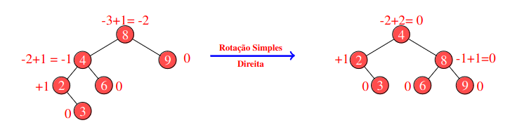

(a rotação esquerda é análoga, apenas mudando o sentido para a esquerda);

Exemplificando as rotações duplas:

 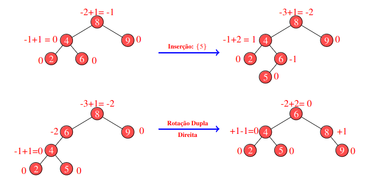

(nota-se que após a inserção do 5 se faz uma rotação simples para esquerda e depois para a direita, para rotação dupla à esquerda apenas troca a ordem, primeiro para direita e depois para a esquerda).

- O custo computacional de pesquisa na árvore AVL é O(log n).

### Huffman

A árvore de huffman, ou codificação de huffman, é o conceito de codificar com menos bits as palavras que mais ocorre, e as que menos ocorre com mais bits, vale ressaltar que o uso das palavras de mais ocorrência é referente a este trabalho, codificação de huffman pode ser usada para outros critérios, como cor de foto, áudio, etc. A função responsável por criar a árvore de Huffman é a ` HuffmanTree(...)`, onde ela percorre toda uma fila prioritária em quando ela for maior que 1. Dentro dessa função compara as duas posições, criando um novo Nó da struct de huffman que recebe como ocorrência a soma das ocorrências desses dois primeiros elementos da fila, e como filho esquerdo o primeiro elemento da fila e como filho esquerdo o segundo elemento. Remove os dois primeiros objetos da fila prioritária e coloca esse novo nó na fila novamente. Após o fim do loop chama a função `decoderHuffman(...)` que faz a decodificação de cada bit de cada palavra, salvando no Nó, a cada vez que se anda para esquerda se acrescenta um "0" no código, caso a direita adiciona "1".

Para fazer a implementação dessa árvore foi usado a [priority_queue](#priority_queue), pelo fato dela organizar a fila de acordo com uma função criada, no caso `pair_maior` que se encontra dentro do arquivo structs.hpp.

Exemplificando a 

  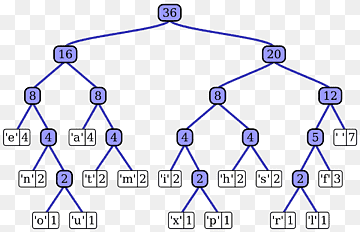

# Ferramentas

### Map

É uma classe que armazena informações em pares, onde uma é a chave e outra é o valor, cada elemento tem que possuir sua própria chave, caso contrário vai ter colisões. Vale ressaltar que ele fornece iteradores bidirecionais, isso permite o acesso dos elementos do map em qualquer ordem. Segundo o site da microsoft  ss containers associativos (map) são otimizados para as operações de pesquisa, inserção e remoção (ambas tem complexidade logarítmica). Os mapas são geralmente implementados como árvores Red–black tree. As árvores Red–black tree são uma estrutura de dados de alta performance que garante a ordenação dos elementos e a exclusividade das chaves - segundo cppreference. Com isso garante que as palavras vão esta ordenadas, (no caso deste algoritmo não faz diferença) o motivo de escolha foi por std::map apresentar ser melhor que o unordered_map quando se vai acessar o valores de forma sequencial (que é caso quando vai se fazer o heapify). Veja abaixo a declaração do tipo map:

  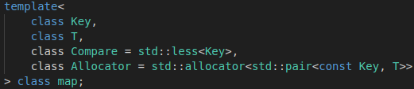

Onde key é o tipo da chave, T o tipo do dado, o compare é uma função que compara as chaves em ordem crescente. Isso significa que a função de comparação `less<Key>` retorna true se a primeira chave for menor que a segunda chave, false se a primeira chave for maior ou igual à segunda chave, e throw se as chaves não forem comparáveis.Veja abaixo os custos computacionais de cada modalidade:

- Inserção: O(log n)
- Pesquisa: O(log n)
- Remoção: O(log n)
- Iteração: O(n)

### Unordered_map

É uma classe que faz o uso da tabela de espalhamento (Hash), mas diferente da map ela não faz ordenação do valores das chaves. São organizados em buckets. O bucket em que um elemento é colocado depende inteiramente do hash de sua chave. As chaves com o mesmo código hash aparecem no mesmo bucket. Isso permite o acesso rápido a elementos individuais, uma vez que, uma vez calculado o hash, ele se refere ao bucket exato em que o elemento está inserido.

  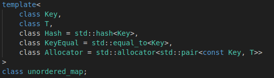

Onde key é o tipo da chave, T o tipo do dado, hash é a função que é usada para calcular o hash das chaves. A função de hash é usada para converter uma chave em um valor inteiro, chamado código hash. O código hash é então usado para armazenar a chave em uma tabela hash. As tabelas hash são uma estrutura de dados que permitem o acesso rápido a elementos, pois os elementos são armazenados em buckets com base em seus códigos hash. KeyEqual é a função de igualdade de chaves que é usada para comparar as chaves e o Allocato para alocar memória pro mapa.

Informação extra: você pode declarar sua própria função hash da seguinte maneira: `unordered_map<int, string, my_hash> my_map;` onde my_hash é a sua função. Veja abaixo o custo computacional de algumas modolidades:

- Inserção: O(1)
- Pesquisa: O(1)
- Remoção: O(1)
- Iteração: O(n)

### Erase

Ela é uma função da biblioteca string, que remove caracteres de uma determinada string passando todos os carácter sucessor ao removido para esquerda para ocupar os lugares em branco. Ao fim do tamanho da string é reduzido de acordo com a quantidade de posições apagadas. Explicação:

1. A função primeiro verifica se o argumento pos (posição do primeiro caracter) é válido. Se não for, a função lança uma exceção out_of_range.
2. A função então obtém o iterador para o primeiro caractere a ser removido.
3. A função itera sobre todos os caracteres seguintes ao primeiro caractere a ser removido e move cada um para a esquerda para preencher o espaço vazio.
4. A função então diminui o comprimento da string pelo número de caracteres removidos.
5. A função retorna um iterador que se refere ao caractere que agora ocupa a posição do primeiro caractere removido.

No código foi usada essa função, com outra dentro (remove), onde essa é um algoritmo que recebe iteradores no início e no final do contêiner e o valor a ser removido (`remove(sring.begin(), string.end(), char)`). O motivo de usar as duas funções juntas é que a função erase remove ou um intervalo de uma string ou uma posição única, já usando remove ela vai remover todas as ocorrências daquele carácter e apagar os intervalos que ela ocorre. Veja abaixo uma implementação disso de acordo o cpp reference:

  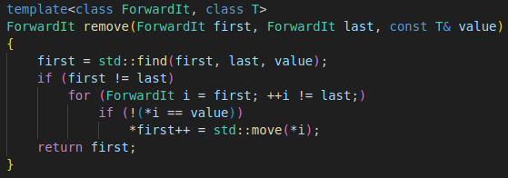

1. first, last    -  o intervalo de elementos a processar
2. value    -  o valor dos elementos a remover
3. policy   -  a política de execução a ser usada. Consulte a política de execução para obter detalhes.
4. p  -  um predicado unário que retorna ​true se o elemento deve ser removido.

### Istringstream

A classe std::basic_istringstream usa uma implementação de dispositivo de string bruto de std::basic_stringbuf para armazenar a string que será usada como fonte de dados. A classe então usa os métodos de std::basic_istream para ler dados da string. Os métodos de std::basic_istream são usados para ler dados de uma stream (stream é uma sequência de dados que são processados em sequência) de caracteres. Os métodos disponíveis incluem read(), gcount() e gpeek(). O método read() lê um número especificado de caracteres da stream e os retorna em um buffer. O método gcount() retorna o número de caracteres que foram lidos da stream com o último chamado de read(). O método gpeek() retorna o próximo caractere que será lido da stream, mas não o remove da stream. A classe std::basic_istringstream usa os métodos de std::basic_istream para ler dados da string que foi definida com o método str(). Os dados lidos da string são então armazenados na classe std::basic_istringstream e podem ser acessados usando os métodos de std::basic_istream.
No código o operator `>>` dentro do loop do while serve como delimitador (no caso o espaço) para pegar apenas o valores que tem entre os caracteres vazios.

### Transform

Essa função faz parte da biblioteca algorithm, ela basicamente analisa de início ao fim (um intervalo) algum tipo de entrada e aplica uma função em cada pedaço desse intervalo. Segundo a biblioteca cpp reference o transform inicializa o iterador (first 1)para inicio do primeiro intervalo (que vai ser percorrido), depois ele inicializa outro iterador (d_first) para o início do intervalo de destino. Enquanto o iterador first1 não foi igual ao last1, a função passada como parâmetro será executada no local apontado. O resultado vai para posição apontado pelo iterador d_first, em seguida d_first e first1 são incrementados. Ao final da execução returna o d_first. Segue abaixo um exemplo de implementação:

  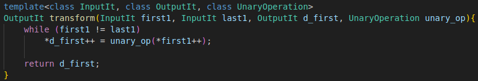

### Heapify

Ele é um algoritmo usado no heapsort, onde usa o conceito de pai e filho. Ele começa da metade do vetor e vai decrescendo conforme as interações. A posição i é chamada de pai, as posições (i\*2+1) de filho esquerdo e (i*2+2) de filho direito. Enquanto na interação o filho esquerdo for menor ou igual ao do tamanho final do vetor (K), ele vai analisar se o filho à esquerda é maior que o da direita. Caso sim, pega-se a posição do filho direito e compara com o pai. Caso o pai seja maior, troca-se os dois de posição, e agora passa analisar a partir da posição do filho atual até não ter mais filhos para comparar. Esse processo vai acontecer até o for chegar à posição zero do vetor. Ao final da execução, os valores não estarão ordenados, mas na primeira posição do vetor sempre vai estar o dado de menor valor (ocorrências). O custo do heapify é de log(n), mas no caso desse algoritmo seria log(K). 

- Vetor de 6 posições, como é par não começa no meio certinho.

   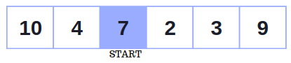

- Pai e filhos.

   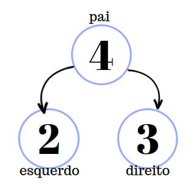

- Exemplo de uma verificação completa:

   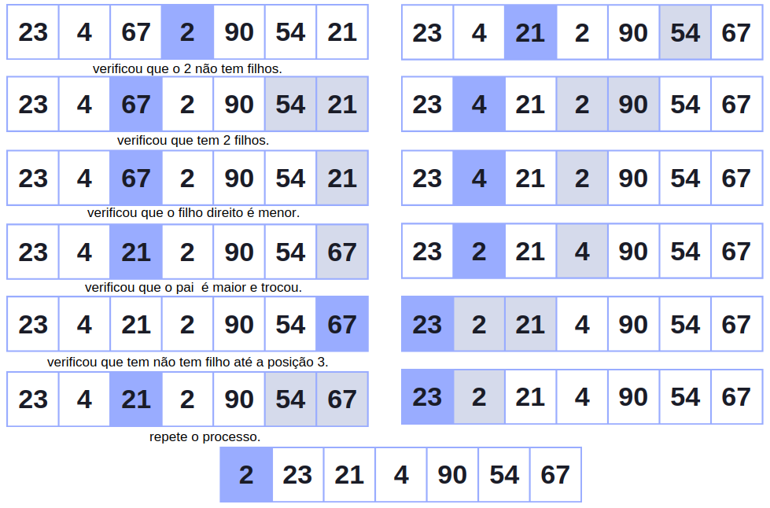

### Priority_queue

Essa função faz parte da biblioteca ... e ela é responsavel por manter um conceito de fila, onde se adiciona no final e se remove no incio, mas tem uma prioridade quando vai ser adicionada, analisando a função de prioridade. Uma priority queue é uma estrutura de dados que armazena elementos em ordem de prioridade. Os elementos com maior prioridade estão no topo da fila, e os elementos com menor prioridade estão no final. A implementação padrão de uma priority queue em C++ é baseada em uma heap binária. Um heap binário é uma estrutura de dados em que cada nó tem um valor maior ou igual aos valores de seus filhos. Isso garante que o elemento com maior prioridade sempre esteja no topo da heap. A operação de busca em uma priority queue é constante, pois o elemento com maior prioridade sempre está no topo da heap. As operações de inserção e extração são logarítmicas, pois envolvem mover o elemento para cima ou para baixo na heap para manter a ordem de prioridade.

   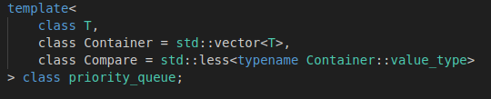

Para criar uma função de prioridade para uma priority_queue, você precisa criar uma função que recebe dois elementos como entrada e retorna um valor booleano. O valor booleano deve ser true se o primeiro elemento tiver maior prioridade que o segundo elemento, e false caso contrário. Você pode colocar a função bool prioridade_crescente dentro de uma struct para encapsular o código que implementa a função de prioridade. Isso pode ser útil por vários motivos:

- Organização: Isso pode ajudar a organizar o código e torná-lo mais fácil de entender.
- Reutilização: Isso pode facilitar a reutilização da função de prioridade em outros programas.
- Testabilidade: Isso pode facilitar o teste da função de prioridade.

# Output

Ao final do algoritmo é gerado um arquivo output.data que contém cada palavra que for pesquisada, em cada arquivo, e para cada palavra pesquisada existente apresenta as 3 árvores (binária, avl e huffman) sendo printadas em largura.

   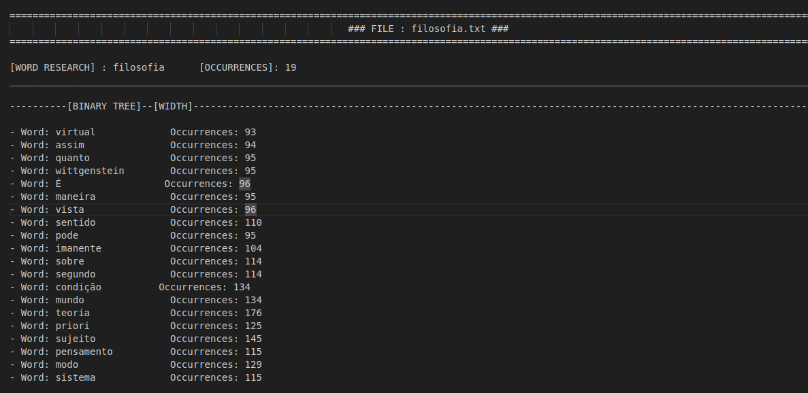

Tempo de execução:

   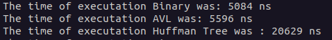

# Conclusão 

Conclui-se que as escolhas de estruturas possibilitaram uma boa execução do código. Durante a formulação desse trabalho, foi usado o Regix, que fez o tempo de execução do algoritmo 10 vezes mais lento. Quando trocado pelo transform, o tempo foi reduzido significativamente. O conceito de hash se torna muito funcional nesse algoritmo, devido ao fato de que se uma colisão ocorrer, é devido ao fato de aquela chave já existir. Isso pode ser usado como um contabilizador para as palavras.O uso do heapify possibilitou que trocas desnecessárias durante a execução do código não acontecesse. Isso ocorre porque ele coloca o menor valor no topo e apenas ele é comparado com as ocorrências do hash, em vez de verificar todos os K elementos.

Ademais verifiquei também que árvores Binárias pode tender muito a ter sub-árvores muito desproporcionais dependendo se a inserção está muito desorganizada, ou seja , quando foge o padrão de um vetor de dados semi organizados, como exemplo, se os números de ocorrência fossem fornecidos de forma decrescente a sub-árvore esquerda iria ser maior que a direita. Já utilizando a AVL esse problema diminui devido às rotações, pois quando a árvore começa a desnivelar ela é rotacionada a fim de garantir uma boa estrutura, o máximo de altura diferente permitida é de até 2 níveis, mas ao implementar essa árvore, vi que sua implementação não é tão trivial quanto a Binária, e apresentou um tempo de execução maior para fazer todas as inserções. Abordando a de huffman, vi que o tempo aumentou ainda mais comparada as duas árvores apresentada, isso devido ao fato dela ter que fazer várias sub-árvores e alocá las em outras sub-árvores que já existe/ou foi criada anteriormente, e depois é necessário fazer um processo de descodificação para saber o código de cada palavra presente, mas feito isso fica fácil o acesso apenas digitando aquele código, pois é apenas seguir o caminho dos bits. Sobre a árvore de Huffman concluo que o processo de montagem pode ser demorado, mas depois de pronto e com os códigos garante um acesso muito rápido ao dado. 

Dado isso verifiquei que as Árvores binárias são estruturas de dados simples e fáceis de implementar, mas podem apresentar baixa eficiência em operações de pesquisa e ordenação quando os dados são inseridos de forma desordenada. Ademais as árvores AVL são uma variação de árvores binárias que garantem um custo logaritmico em operações de pesquisa e ordenação, mesmo quando os dados são inseridos de forma desordenada. Isso é feito por meio de operações de balanceamento, que são realizadas sempre que uma nova inserção ou remoção ocorre. Por fim, a árvore de Huffman é um algoritmo de compressão de dados que usa uma árvore binária para representar os dados de entrada. A árvore é construída de forma a que os símbolos mais frequentes sejam representados por códigos mais curtos, resultando em uma redução no tamanho dos dados.

# Compilação e Execução

Esse pequeno exemplo possui um arquivo Makefile que realiza todo o procedimento de compilação e execução.  Para tanto, temos as seguintes diretrizes de execução:

| Comando                |  Função                                                                                           |                    
| -----------------------| ------------------------------------------------------------------------------------------------- |
|  `make clean`          | Apaga a última compilação realizada contida na pasta build                                        |
|  `make`                | Executa a compilação do programa utilizando o gcc, e o resultado vai para a pasta build           |
|  `make run`            | Executa o programa da pasta build após a realização da compilação           

# Referências

* https://cplusplus.com/reference/string/string/erase/;
* https://en.cppreference.com/w/cpp/algorithm/transform;
* https://en.cppreference.com/w/cpp/algorithm/remove;
* https://en.cppreference.com/w/cpp/container/priority_queue;

# Contatos
<a>
✉️ <i>lucaslimadeoliveira80@gmail.com</i> 
</a>